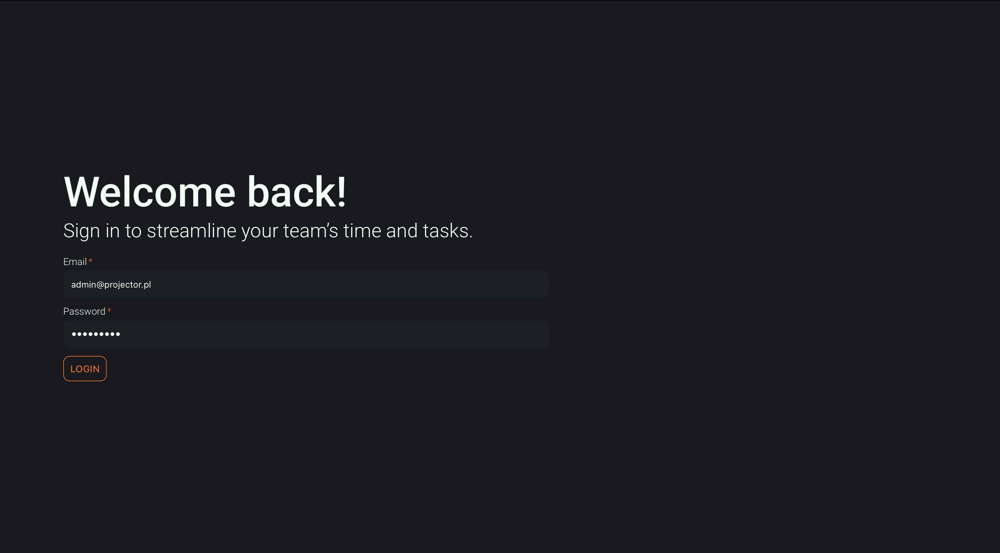
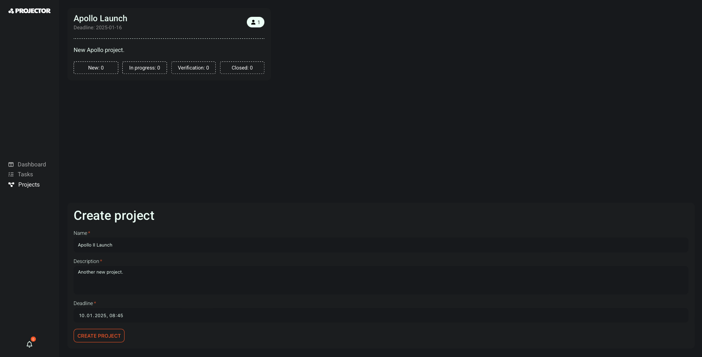
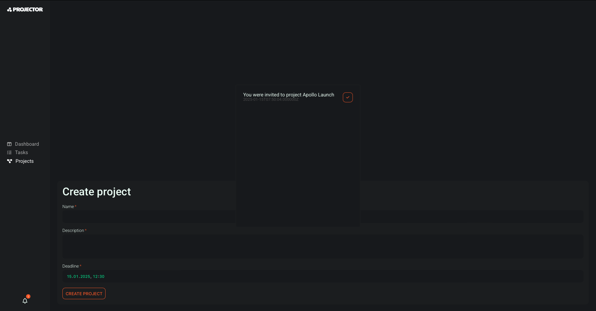
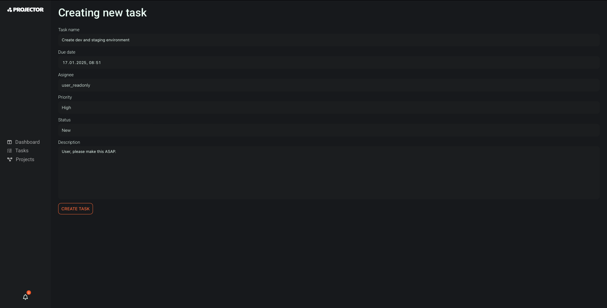
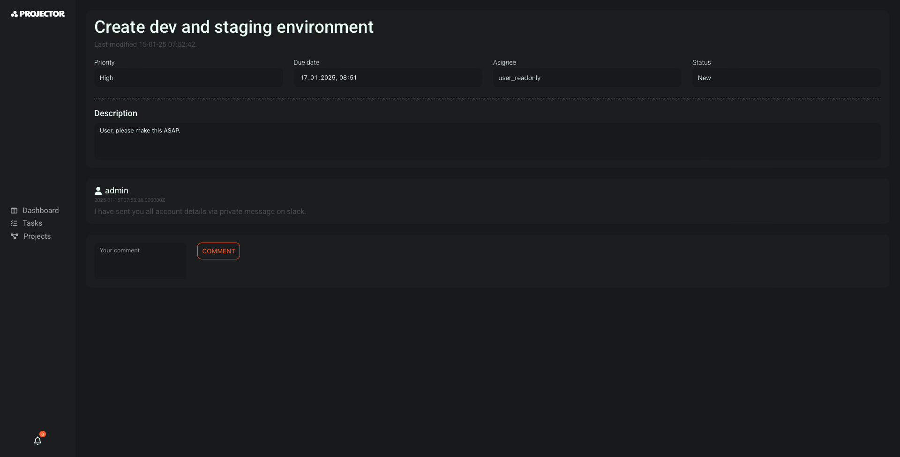
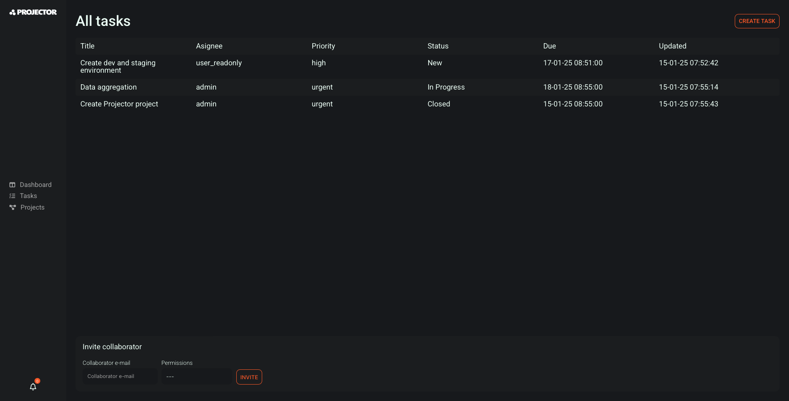
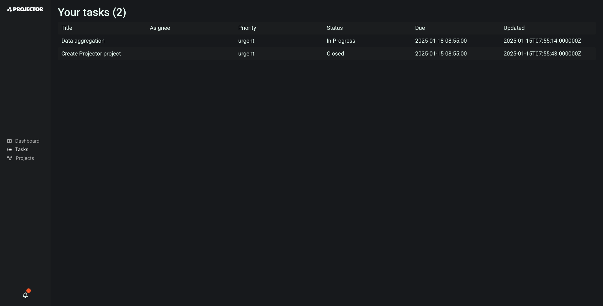
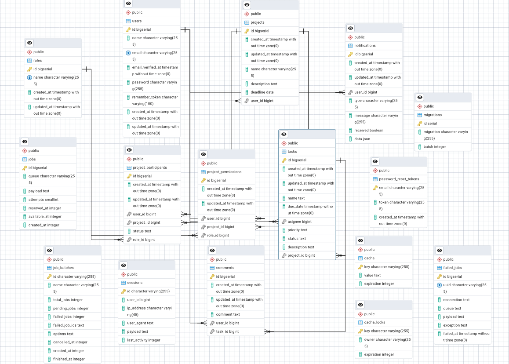

# PROJECTor

**PROJECTor** is a project management application designed to improve the organization and tracking of tasks in teams.  Created to pass the subject "Introduction to Web Applications" at Krakow University of Technology.

## Features

- **Project Management**: Create, edit and delete projects.
- **Task Management**: Adding, updating and tracking the progress of tasks.
- **User Roles**: Different levels of access for users, including administrators and users with limited privileges. (Full access, Read-only).
- **Notification System**: Simple notification system based on long-pooling.

## Technologies used
- **PHP**
- **Laravel**
- **PostgreSQL**
- **Inertia.js**
- **React.js**
- **SCSS**
- **Docker**

### Login

### Create new Project

### Invite a new collaborator
Privilleges can be set there.

User will recieve notification in no time.

### Creating a task
You can create and delegate tasks with a given priority.

### Communication with the team through threads

### Task list
View all tasks in the project, view all tasks assigned to You.

## ERD Diagram

